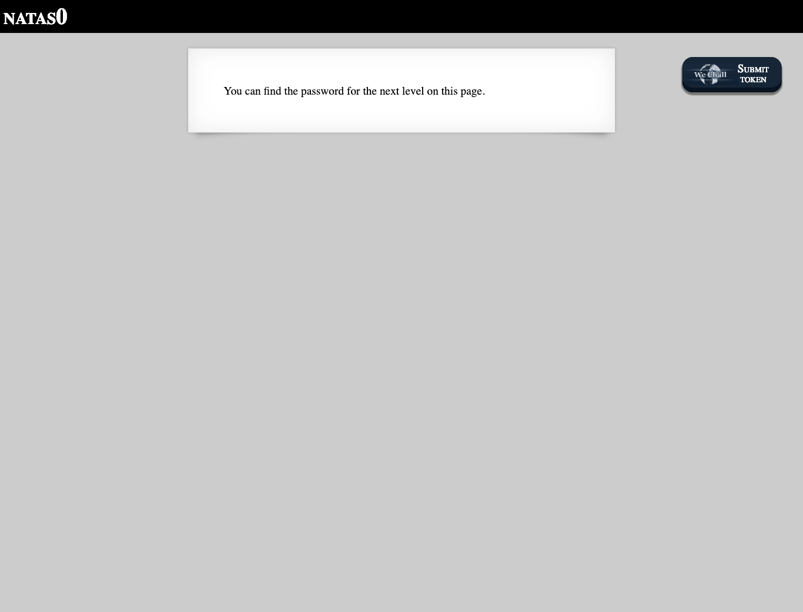
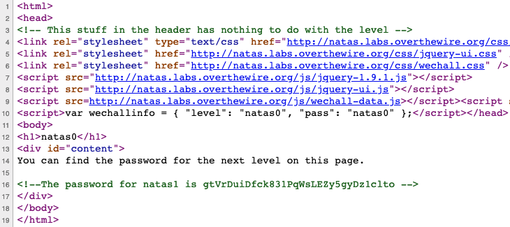

# Level 0

<http://natas0.natas.labs.overthewire.org>

The only hint given is "You can find the password for the next level on this page." Since the page is essentially empty apart from that hint, let's check out the source code. The password is hidden in plain sight as a comment there.

