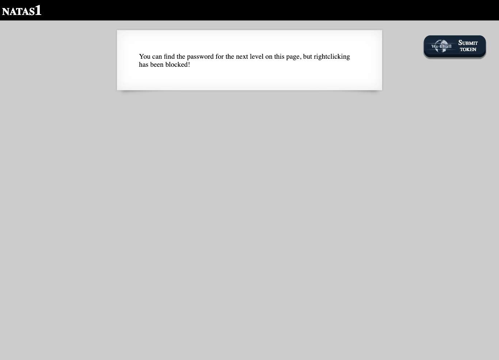
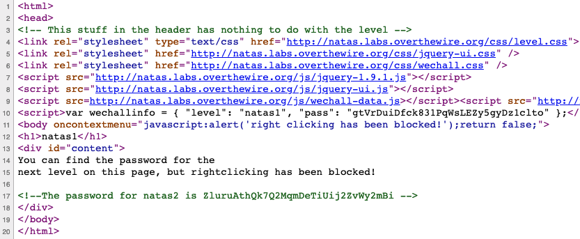

# Level 1

<http://natas1.natas.labs.overthewire.org>

Same approach as Level 0. They tried to block us from viewing the source code via the right-click menu, but it can still be done using the `View` → `Developer` menu in Chrome, or with a keyboard shortcut.

