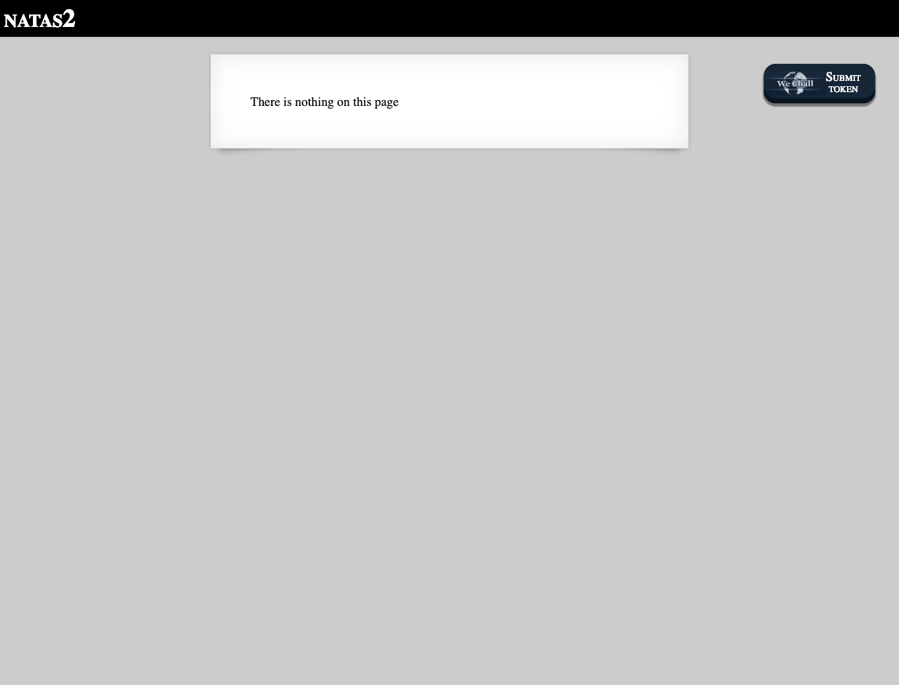
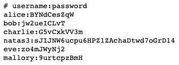

# Level 2

<http://natas2.natas.labs.overthewire.org>

It isn't entirely true that "there is nothing on this page". The source code reveals that there is a 1x1 pixel linked to an image in a `files` directory.

Listing that directory reveals a `users.txt` file containing several credentials, one of them being the password for Level 3.

