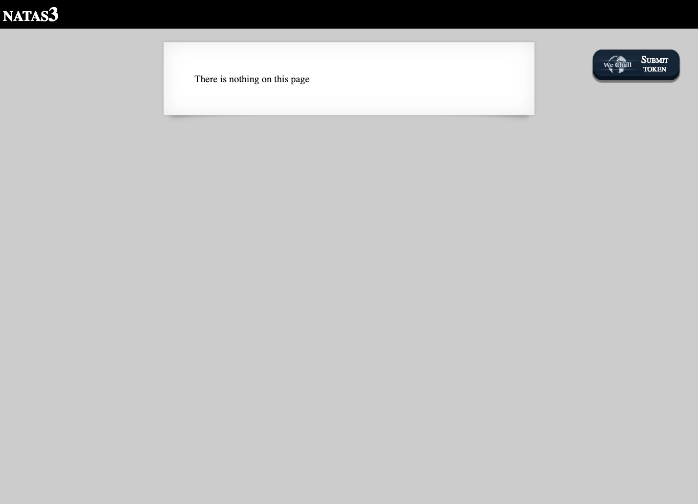
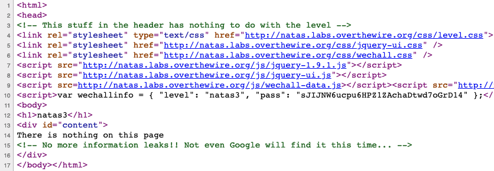
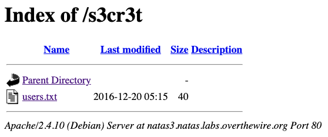
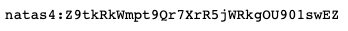

# Level 3

http://natas3.natas.labs.overthewire.org



The hint is a bit more obscure this time, but the reference to Google is significant. Websites often use a `robots.txt` file to instruct search engines (such as Google) on how they should be crawled and indexed.



During the Week 2 lecture, it was pointed out that these files can be a valuable source of information as it reveals what website owners *don't* want to be made public.

Since `robots.txt` must live in the root directory of a site, we can access it at <http://natas3.natas.labs.overthewire.org/robots.txt>. The contents of that file are as follows:

```
User-agent: *
Disallow: /s3cr3t/
```

Navigating to the 'disallowed' directory at <http://natas3.natas.labs.overthewire.org/s3cr3t> brings us to another directory listing (like we saw in Level 2).




This time, the `users.txt` file contains a single line with the credentials for Level 4.


