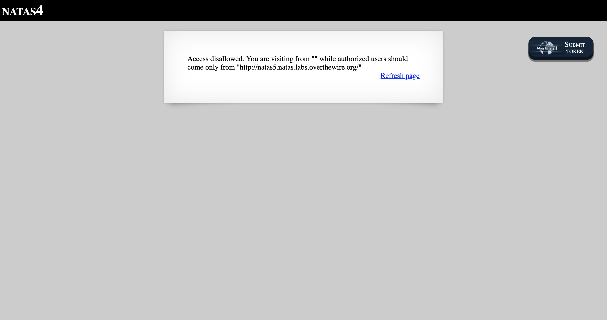
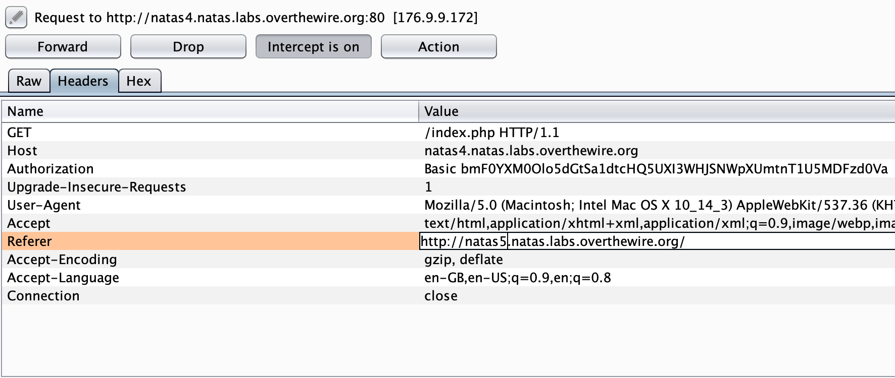
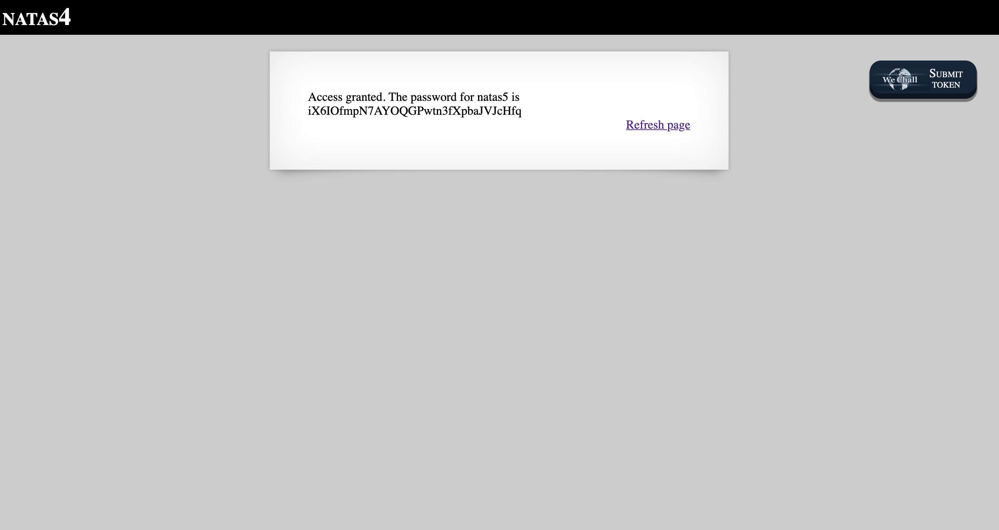

# Level 4

http://natas4.natas.labs.overthewire.org

The note explicitly specifies that we should be coming from `natas5`. This is a simple matter of changing the HTTP referrer, which can be done using BurpSuite.

After forwarding the request, the password for Level 5 is shown on the page.

