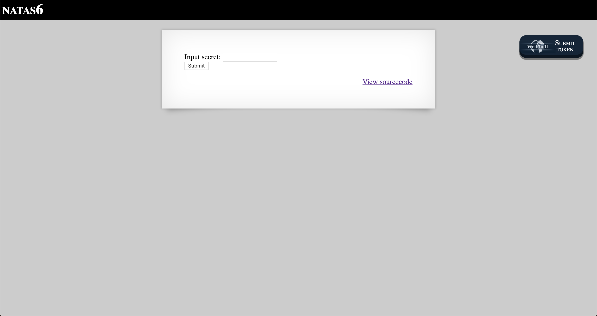
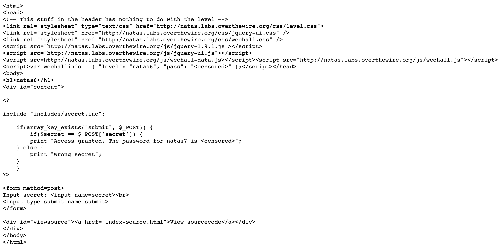
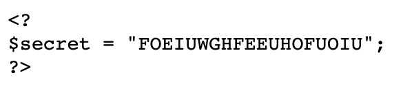
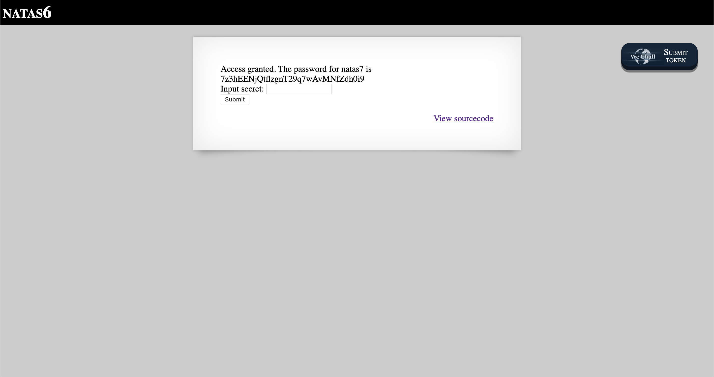

# Level 6

http://natas6.natas.labs.overthewire.org

This page contains an input field that is presumably the key to unlocking the password for Level 7. There is also a link to 'View sourcecode' linked to the following page.

The password is `<censored>`, but examining the PHP snippet more closely, the first line is of particular interest: `include "includes/secret.inc";`. If we navigate to that path in the browser at <http://natas6.natas.labs.overthewire.org/includes/secret.inc>, the `$secret` variable is directly shown in plain text.

All that's left to do now is to enter the value of `$secret` in the original input field and submit the form.

