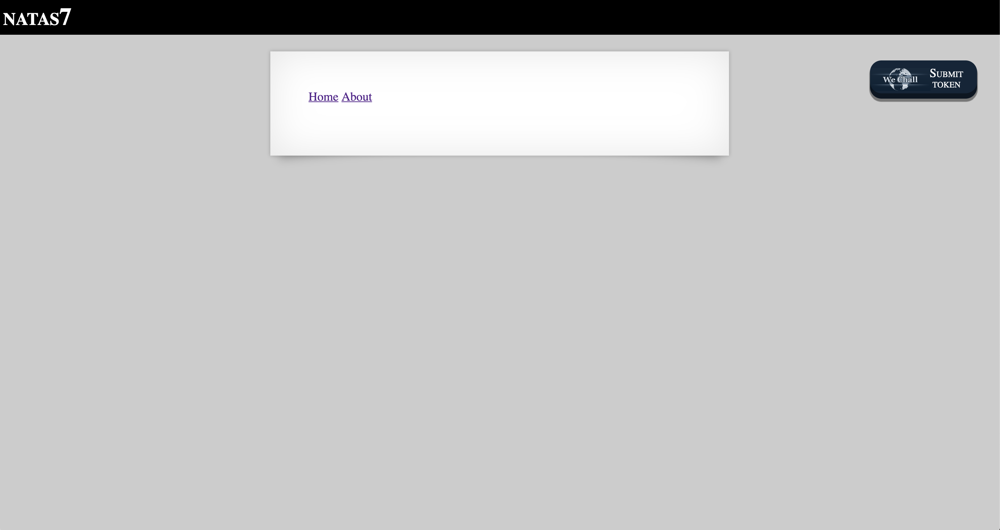
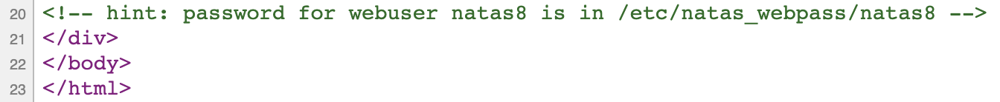
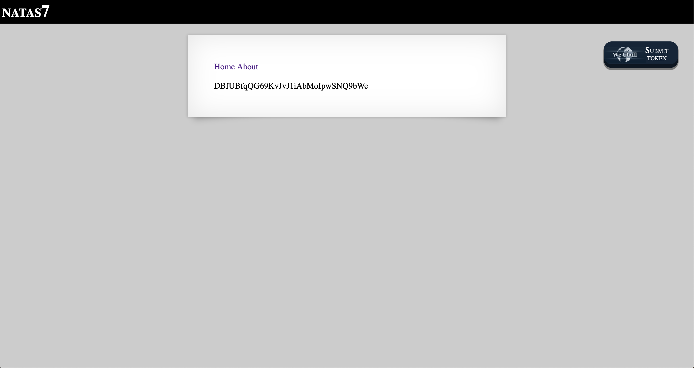

# Level 7

http://natas7.natas.labs.overthewire.org

This page is largely empty except for two links. Clicking them doesn't do anything other than add descriptive text in the container element: 'this is the front page' and 'this is the about page', respectively. Taking a look at the page source, it turns out there's a hint showing where the password for Level 8 is located.

This is a web server directory... and there are no user input fields on the page to potentially run commands in.

However, if we note the URL paths after clicking the aforementioned links, 'Home' links to `/index.php?page=home` and 'About' links to `/index.php?page=about`. The query string is takes a single argument which is used by the server to render the page content.

We have the path to the password, so we simply need to enter it as a relative path in the query string: <http://natas7.natas.labs.overthewire.org/index.php?page=../../../../etc/natas_webpass/natas8>.

The password is now rendered as part of the page content.

