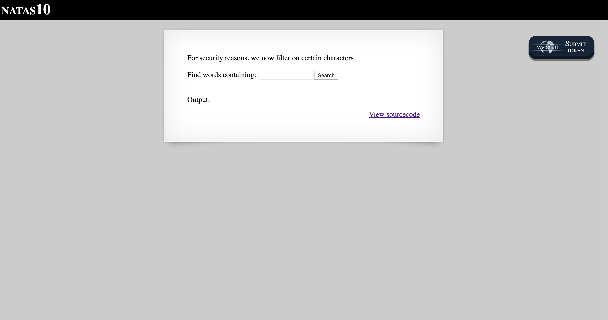
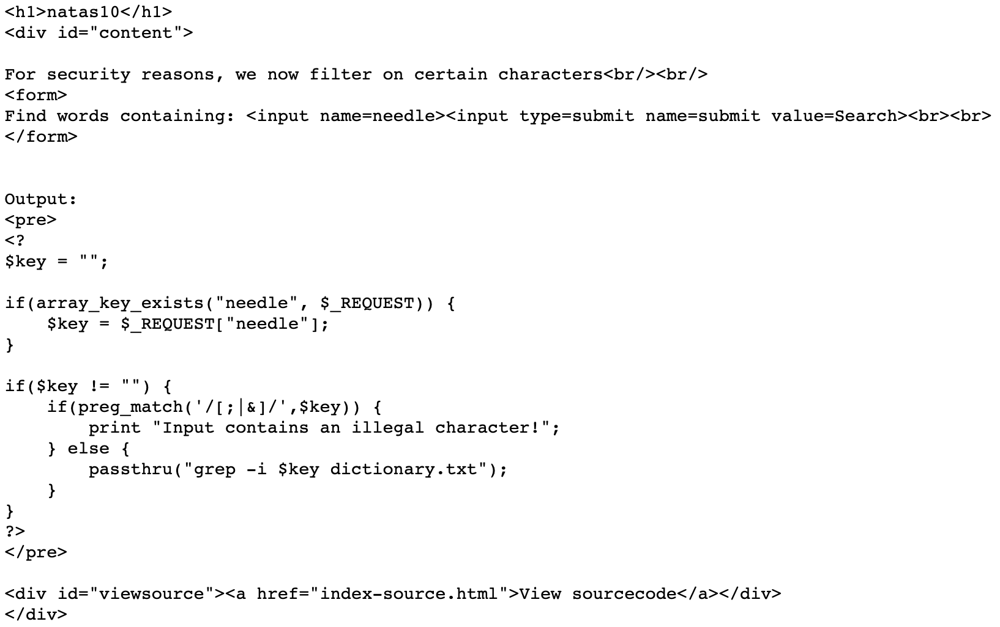
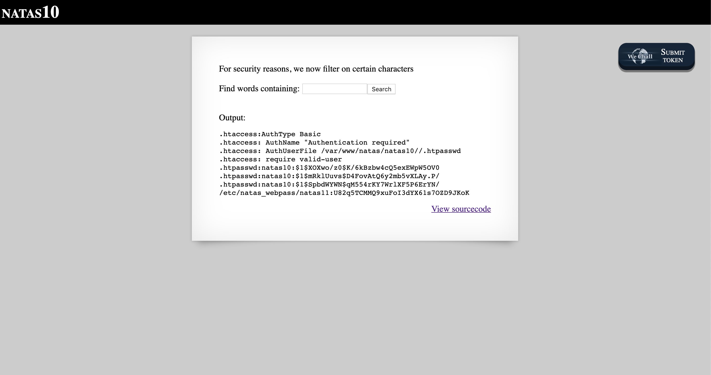

# Level 10

http://natas10.natas.labs.overthewire.org



There is a prominent button to 'View sourcecode'. Clicking on it brings us to the following code.



This is similar to Level 9, except we can no longer terminate our injected command with `;` or `&&` since these characters are sanitised. However, since `grep` supports regular expressions, we can craft a payload...

```
.* /etc/natas_webpass/natas11 #
```

...to change the file which is being searched. The password for Level 11 is then shown.


