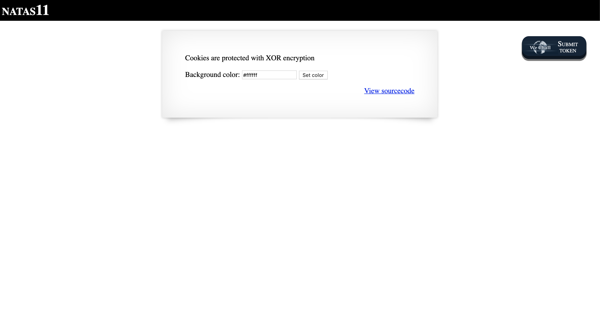
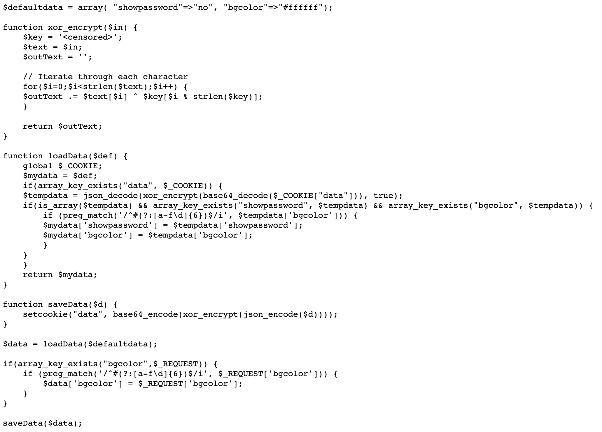
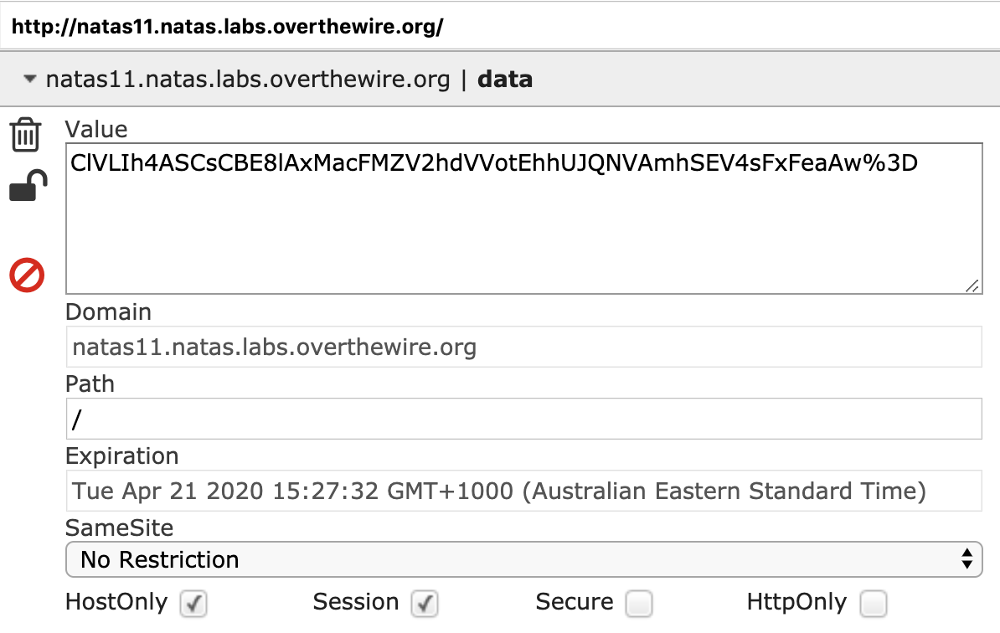
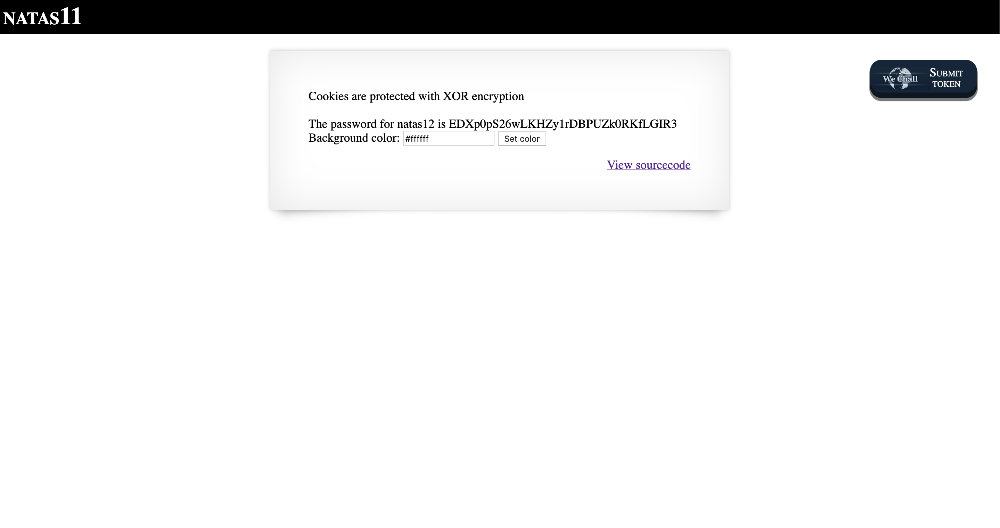

# Level 11

http://natas11.natas.labs.overthewire.org



The page says that cookies are protected with XOR encryption. Clicking on 'View sourcecode' brings us to the following code.



Examining the cookies, we can see an encoded string.



According to [Wikipedia](https://en.wikipedia.org/wiki/XOR_cipher), an XOR cipher has the property of

$$\text{plaintext} \oplus \text{ciphertext} = \text{key}$$

Looking at the sourcecode of the page then, we can reverse the cipher with the following code.

```php
function xor_decrypt($in) {
    $key = base64_decode('ClVLIh4ASCsCBE8lAxMacFMZV2hdVVotEhhUJQNVAmhSEV4sFxFeaAw=');
    $text = $in;
    $outText = '';

    for($i=0;$i<strlen($text);$i++) {
        $outText .= $text[$i] ^ $key[$i % strlen($key)];
    }

    return $outText;
}

echo xor_decrypt('{"showpassword":"no", "bgcolor":"#ffffff"}');
```

This prints out `qw8J` repeated a number of times. We can adjust the function to use this as the key to decrypt the payload (with `showpassword` set to `yes` as well), then encode it as Base64.


```php
function xor_decrypt($in) {
    $key = 'qw8J';
    $text = $in;
    $outText = '';

    for($i=0;$i<strlen($text);$i++) {
        $outText .= $text[$i] ^ $key[$i % strlen($key)];
    }

    return $outText;
}

echo base64_encode(xor_decrypt('{"showpassword":"yes", "bgcolor":"#ffffff"}'));
```

Finally, using this as the new value of the cookie, we can reload the page to see the password.


