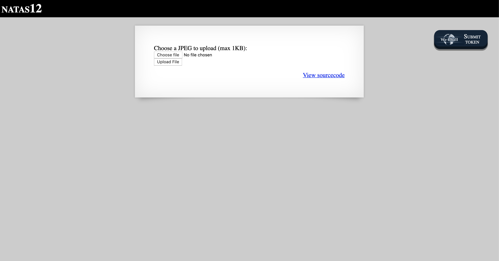
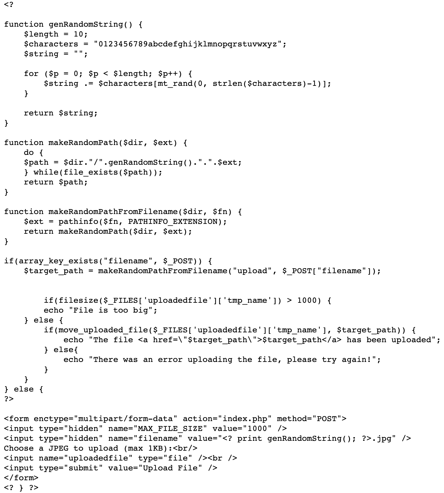
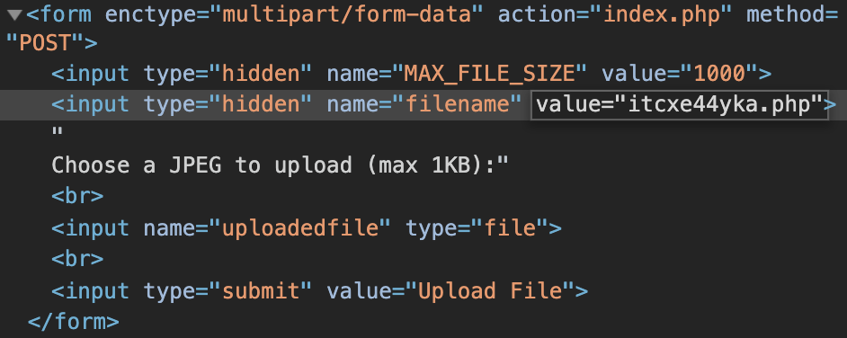
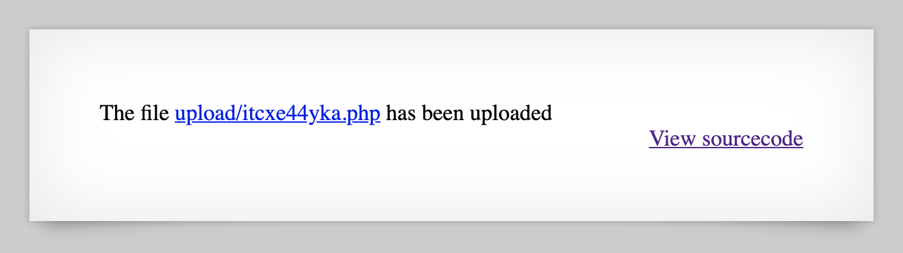

# Level 12

http://natas12.natas.labs.overthewire.org



At first glance, this level seems to lend itself to a file upload attack. Clicking on 'View sourcecode' brings us to the following code.



The filename's `value` is generated by the `genRandomString` method with a `.jpg` extension subsequently appended to it. However, since this is client-side code, it can be directly changed using the browser's DevTools.



Upload a file with the following contents and give it a `.php` extension.

```php
<?php
passthru('cat /etc/natas_webpass/natas13');
?>
```

After a successful upload, we can click on the link to cause the script to be executed by the server and show the password.


