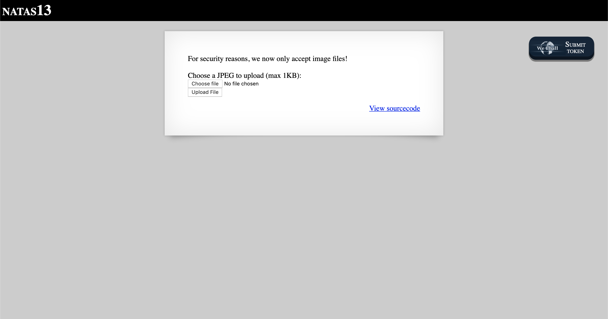
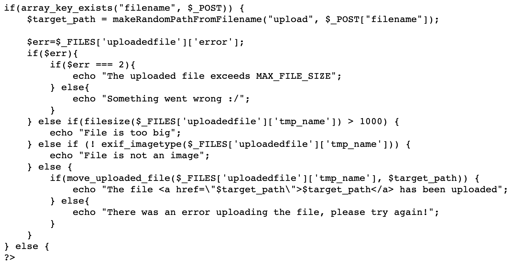
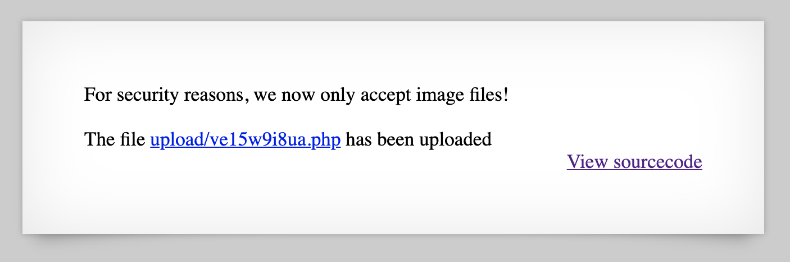

# Level 13

http://natas13.natas.labs.overthewire.org



This initially looks similar to Level 12. Clicking on 'View sourcecode' brings us to the following code.



Note that `exif_imagetype` is now being used to check for the file type instead of a simple file extension sanity check. According to the [PHP documentation](https://www.php.net/manual/en/function.exif-imagetype.ph), this function "reads the first bytes of an image and checks its signature". We can use the same technique as before, but change the file contents to have a leading `BMP` so it gets interpreted as a bitmap image instead.

```php
BMP<?php
passthru('cat /etc/natas_webpass/natas14');
?>
```

Click on the link to see the password (ignore the first three characters, `BMP`, as those were just to bypass the EXIF check).


