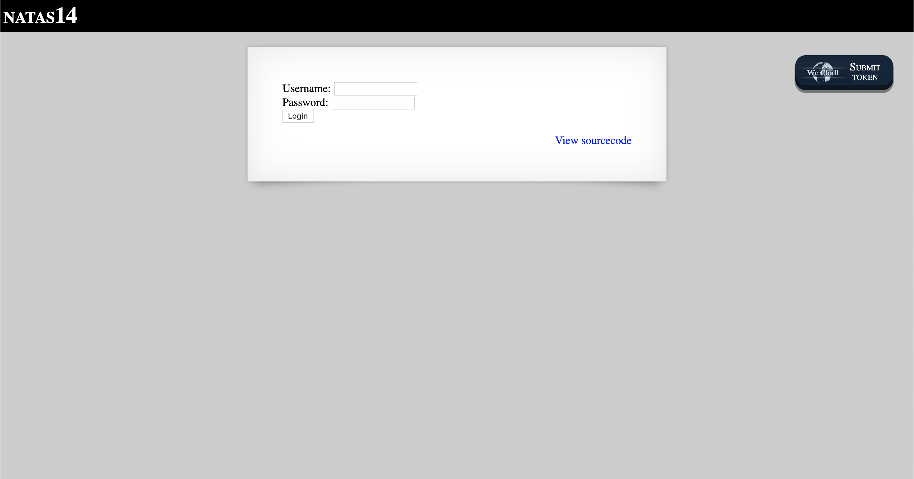
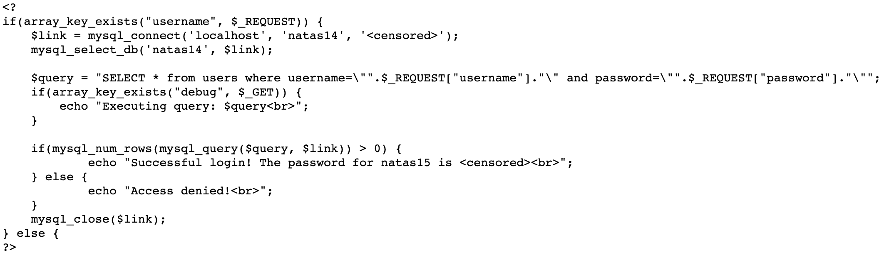
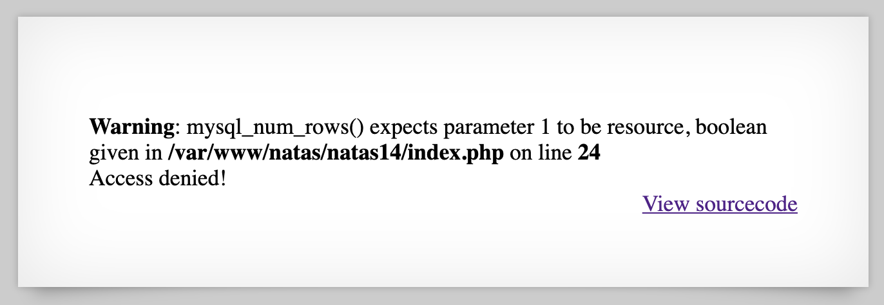
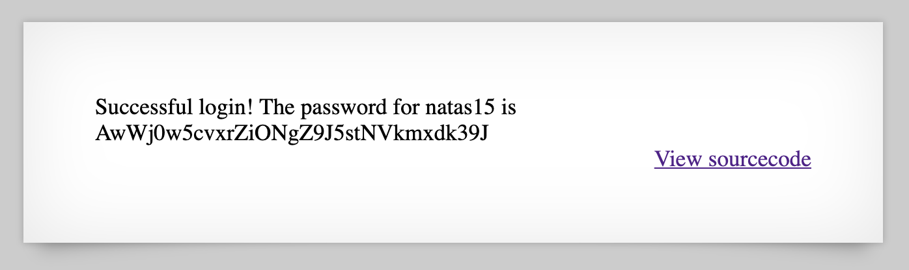

# Level 14

http://natas14.natas.labs.overthewire.org

Clicking on 'View sourcecode' brings us to the following code.

Since there is an SQL query being executed, we can probably utilise an SQL injection attack. Trying the standard payload of `admin` with `" or 1=1` doesn't work as the second half of that statement gets interpreted as PHP.

However, if we comment out the rest with `#`, we get a successful login.

This attack could have been prevented by using parameterised queries and sanitising user input. As mentioned in the lectures, it is a bad idea to mix user-supplied data with code.
