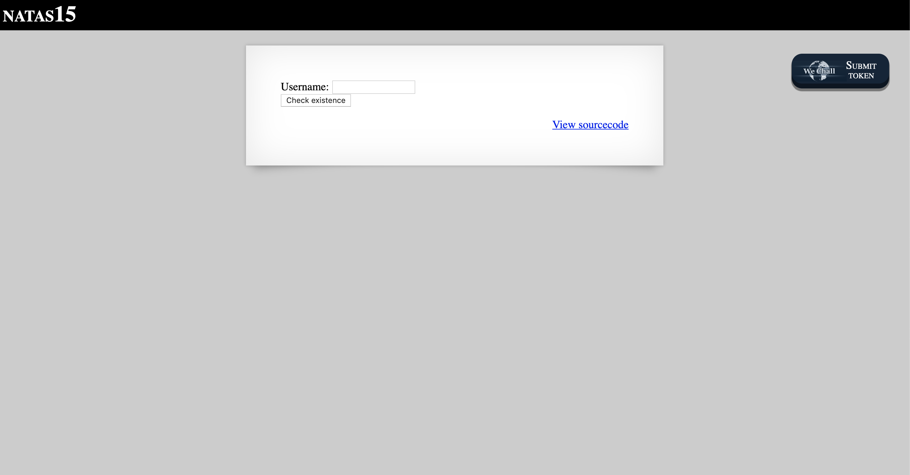
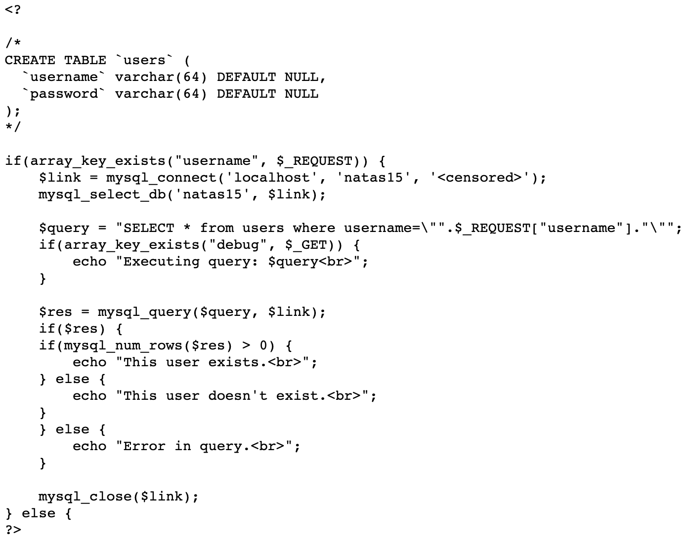
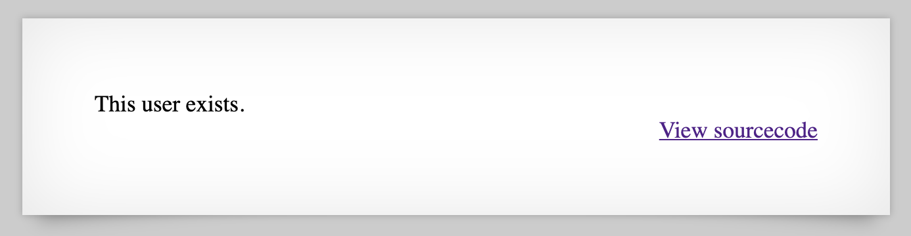
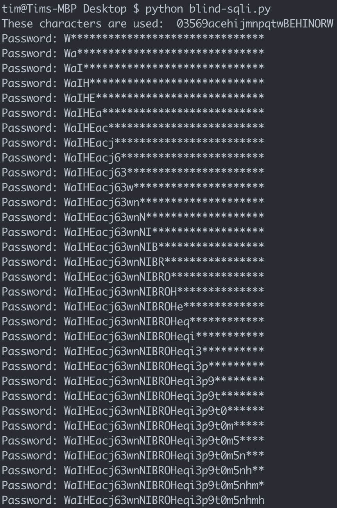

# Level 15

http://natas15.natas.labs.overthewire.org

Clicking on 'View sourcecode' brings us to the following code.

Again, we see an SQL query, and we can also notice that it's a mySQL database. In a real pentest, this would be valuable information as we can tailor our commands to that particular DBMS. Checking for the username `natas16` confirms that this user exists.

This doesn't get shown when submitting the form, but it turns out the server also supports running the SQL query via a GET request, e.g. `?username=natas16`. Passing in a potential password as part of the query string allows us to execute blind SQL injection, e.g. `?username=natas16 and password like guessedpassword`.

We can use an automated script to find out which of the alphanumeric characters are used in the password, and from those, brute force the entire password by appending the characters individually and checking if the page still says "This user exists".

