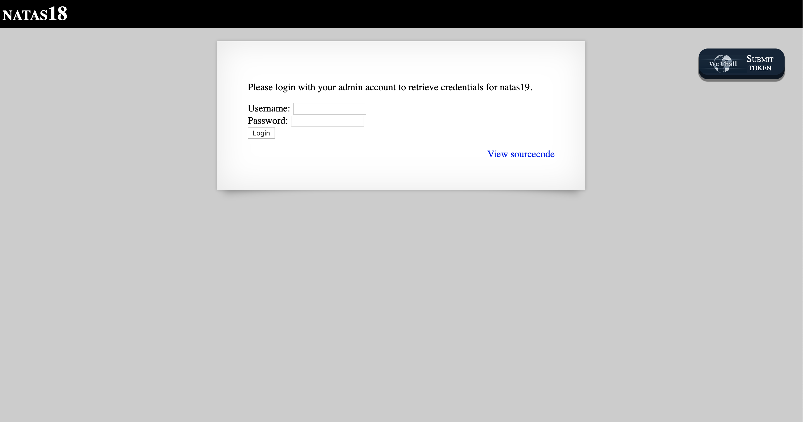
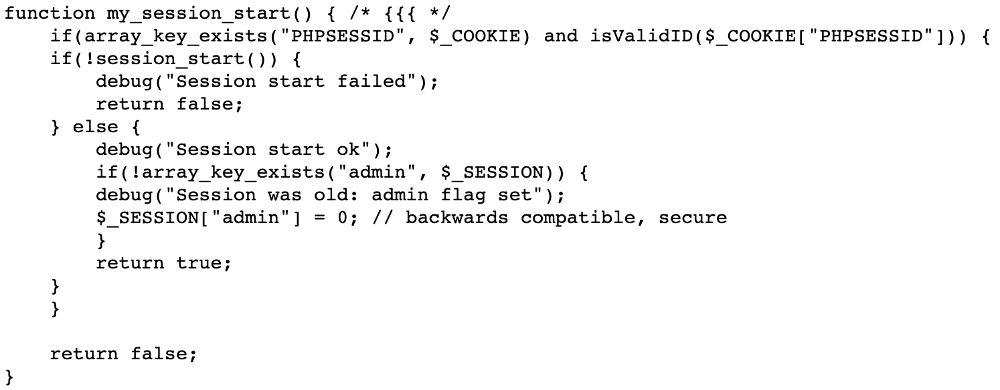
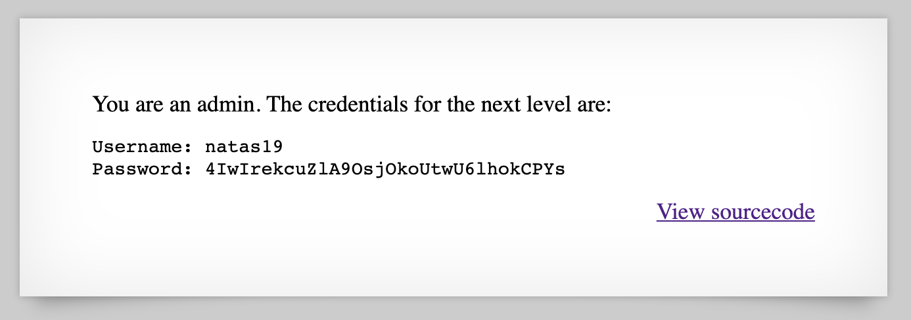

# Level 18

http://natas18.natas.labs.overthewire.org



Within the source code, this function is of particular interest.



If we can somehow guess and correctly set the `PHPSESSID` cookie, we can bypass the login stage altogether. At the start of the code, we can also see...

```php
$maxid = 640; // 640 should be enough for everyone
```

...which means we can easily just brute force all the 3 digit numbers up to 640. Once the `Content-Length` changes, we know we have a hit.

This can easily be accomplished using Using BurpSuite's Intruder functionality. It turns out that `119` is the admin's session ID; replacing the value of the cookie with this number gives us the password for Level 19.


