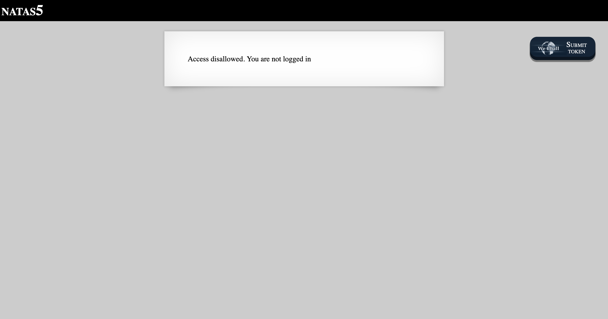
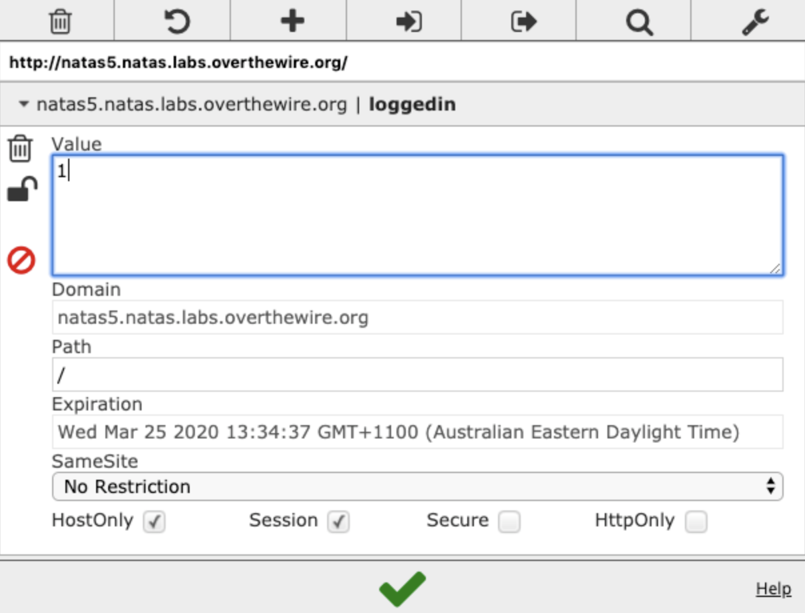
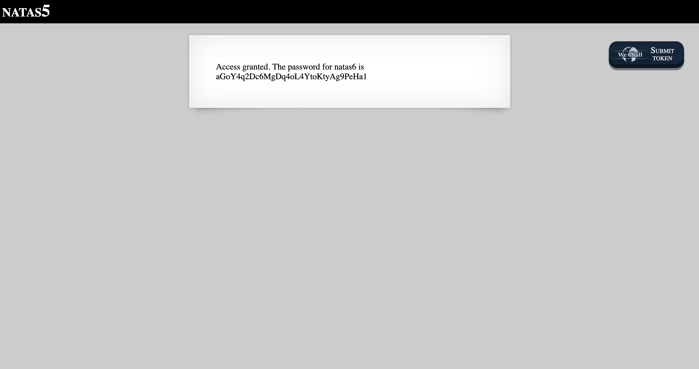

# Level 5

http://natas5.natas.labs.overthewire.org

On first load, the site says we are not logged in. Since login state is commonly managed using cookies, we can use a Chrome extension called [EditThisCookie](https://chrome.google.com/webstore/detail/editthiscookie/fngmhnnpilhplaeedifhccceomclgfbg?hl=en) to inspect and edit the value of the cookies for this page.

After changing the value of the `loggedIn` cookie from `0` to `1` and reloading the page, we can see the password for Level 6.

