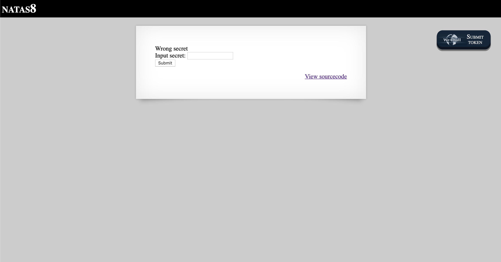
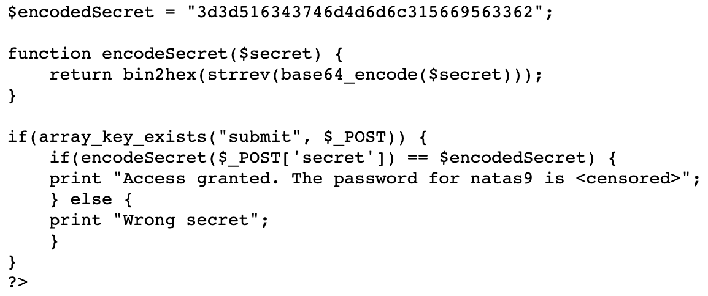
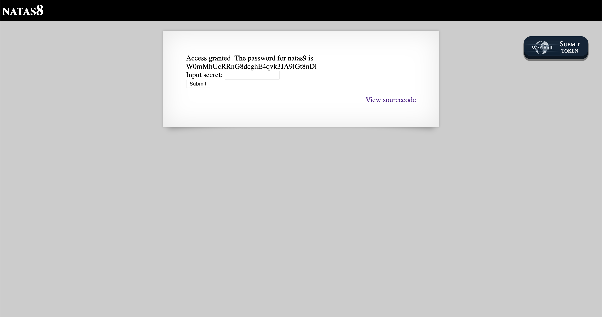

# Level 8

http://natas8.natas.labs.overthewire.org

There is a prominent button to 'View sourcecode'. Clicking on it brings us to the following code.

The operations used to encode the secret are all reversible, so we just need to perform them in reverse order:

- Hex to binary
- Reverse string
- Base64 decode

This can be done with a combination of BurpSuite and JavaScript.

- `3d3d516343746d4d6d6c315669563362` from hex to binary is `==QcCtmMml1ViV3b`
- `==QcCtmMml1ViV3b` reversed is `b3ViV1lmMmtCcQ==`
- `b3ViV1lmMmtCcQ==` from Base64 to plain text is `oubWYf2kBq`

Entering `oubWYf2kBq` as the 'secret' in the original form gives us the password for Level 9.

