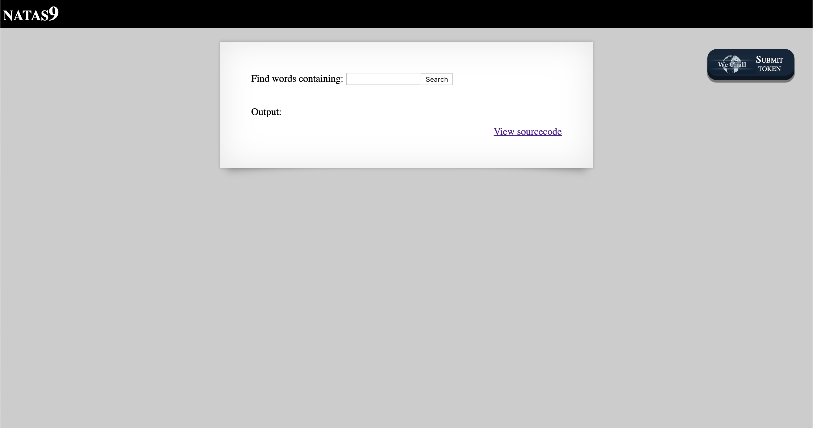
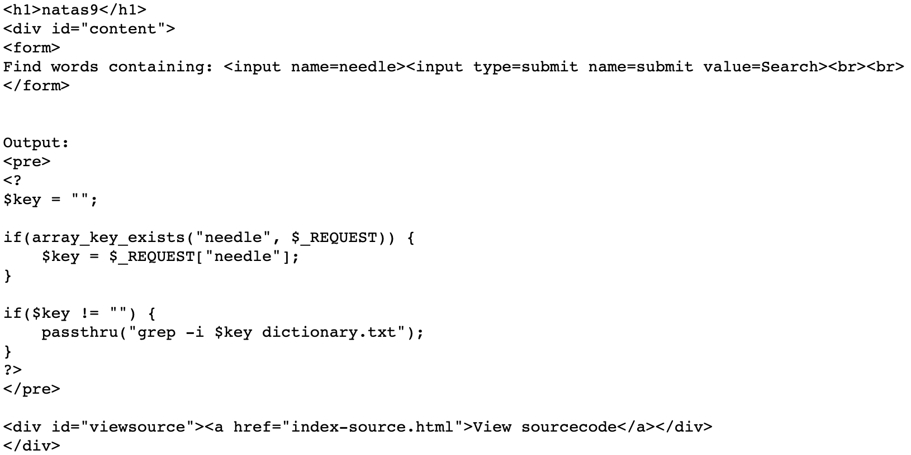
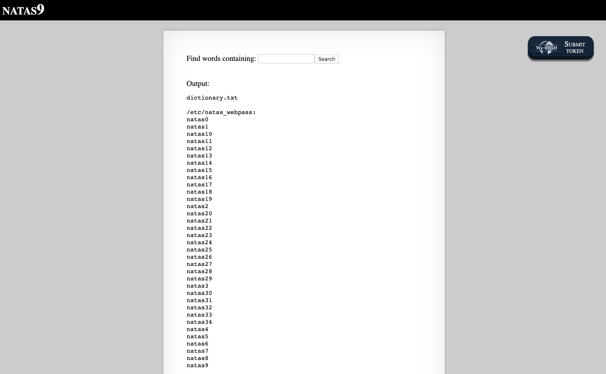
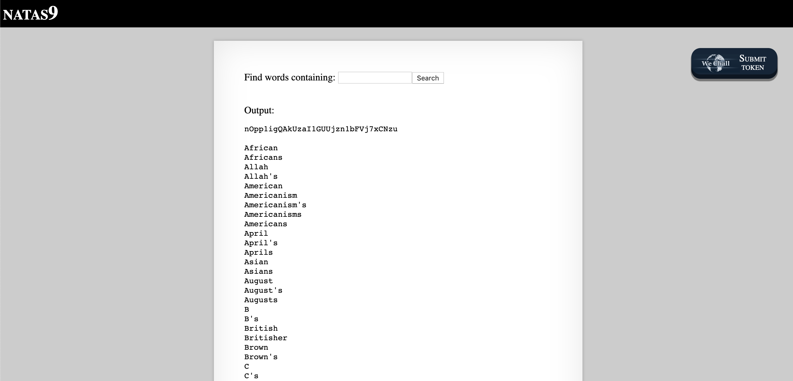

# Level 9

http://natas9.natas.labs.overthewire.org

There is a prominent button to 'View sourcecode'. Clicking on it brings us to the following code.

The PHP code uses `passthru` which executes an external program, so we can probably use a command injection attack here. Entering `; ls` outputs `dictionary.txt`, i.e. the contents of the current directory. After some exploring, we can find a directory `/etc/natas_webpass` which presumably contains the passwords for every challenge.

Entering `; cat /etc/natas_webpass/natas10` displays the password for Level 10.

